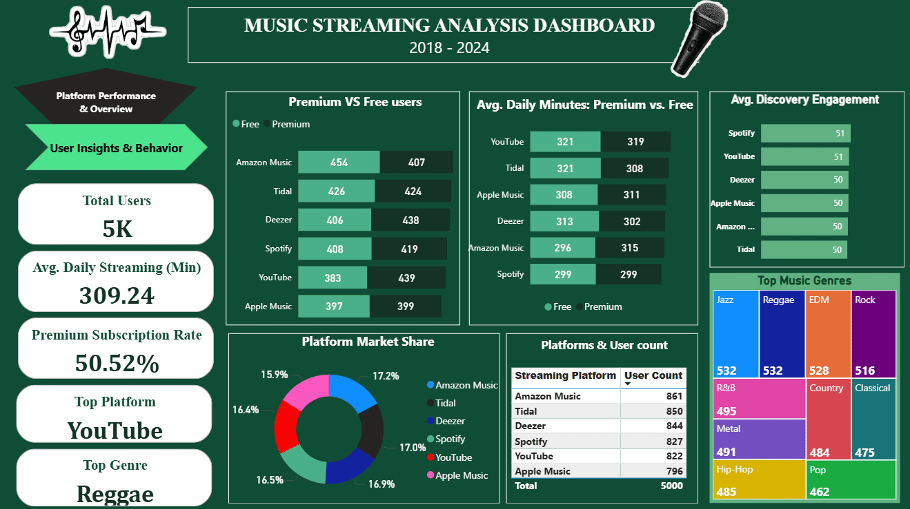

# Music-Streaming-Trends-Analysis-Dashboard

**📖 Project Overview**:

This end-to-end data analysis project explores music streaming trends from 2018 to 2024. It leverages a dataset containing listener demographics, platform usage, genre preferences, and engagement metrics to derive actionable insights for the music industry. The project demonstrates a full-stack data analysis workflow using Python, SQL, and Power BI.

---

Final Dashboard 👇🏻





---

**Cleaned Dataset**:    

---

**🛠️ Tools & Technologies**

- Data Cleaning & Preprocessing: Python (Pandas) in Jupyter Notebook
- Data Analysis: SQL (MySQL)
- Data Visualization: Power BI

---

📊 **Project Workflow**:

**1. Data Cleaning with Python (Jupyter Notebook)**:

Objective: Prepare raw data for analysis by handling missing values and duplicates.

*Process*:

- Used Jupyter Notebook to run Python scripts with the Pandas library.
- Loaded the dataset using pd.read_csv().
- Removed null values (dropna()) and duplicate records (drop_duplicates()).
- Exported cleaned data to cleaned_music_data.csv.

-- **CODE**:

```
# Import the pandas library
import pandas as pd

# Load the dataset from a CSV file
df = pd.read_csv('music_data.csv')

# Display the first 5 rows to inspect the data
print("First 5 rows of the raw data:")
print(df.head())

# Check for missing values in each column
print("\nMissing values in each column:")
print(df.isnull().sum())

# Check the data types of each column
print("\nData types:")
print(df.dtypes)

# Create a cleaned DataFrame by removing rows with any missing values
df_clean = df.dropna()

# Remove any duplicate rows from the cleaned DataFrame
df_clean = df_clean.drop_duplicates()

# Save the cleaned data to a new CSV file for use in SQL and Power BI
df_clean.to_csv('cleaned_music_data.csv', index=False)

# Print a success message and show the first 5 rows of the cleaned data
print("\nData cleaning complete! Cleaned data saved as 'cleaned_music_data.csv'")
print("\nFirst 5 rows of the cleaned data:")
print(df_clean.head())

```
**What this code does**:

Imports Pandas > Loads Data > Inspects Data > Cleans Data > Saves Data > Confirms Success

---

**2. Data Analysis with SQL (MySQL)**:

*Objective*: Answer key business questions through SQL queries.

*Process*:

- Created a MySQL database and imported the cleaned data.
- Wrote 12+ SQL queries in MySQL Workbench (or CLI) to analyze trends.
- Key insights included market share by platform, premium vs. free user engagement, and top genres by country.


-- **CODE**: 

[SQL_analysis_queries](music_project_script,sql)

---

**3. Dashboard Design with Power BI**:

*Objective*: Translate analytical insights into an interactive, visually compelling dashboard.

*Process*:

Developed a 2-page report:

Page 1: Platform Performance & Overview

- KPIs: Total Users, Avg. Listening Time, Premium Subscription Rate, Top Genre, Most Engaging Platform.

- Visuals: Platform market share (donut chart), premium vs. free users (stacked bar), avg. listening time by subscription type (clustered column chart).

Page 2: User Insights & Behavior

- Visuals: User age distribution (pie chart), platform preference by age group (stacked bar), avg. listening time by age (line chart).

Implemented filters and tooltips for interactivity.

---

**Key Insights 🔍**:

- *The Streaming Market is Highly Competitive*: No single platform dominates. The market share is almost evenly split between the top services, with Amazon Music (17.2%), Deezer (16.9%), and Spotify (16.5%) leading a tight race, indicating a diverse and competitive landscape.

- *The Core User Base is Adults Aged 25-54*: A significant 63% of all listeners are between the ages of 25 and 54. This demographic represents the most valuable segment for advertisers and subscription drives, highlighting a mature user base with spending power.

- *Platform Preference Shifts with Age*: User loyalty is fluid and highly dependent on age:

 -- Young Adults (18-24): Prefer Deezer (128 users) and Amazon Music (121).

 -- Millennials (25-44): Shift towards Spotify and Amazon Music.

 -- Older Adults (45+): Tidal becomes the platform of choice for the 45-54 age group (191 users), suggesting a focus on higher audio quality or a different catalog as listeners age.

- *Artist Popularity is a Tight Contest at the Top*: The most played artists are in a near dead heat. Bad Bunny (528 fans) leads a pack where the top 5 artists are separated by just 28 fans, showing a fragmented and diverse taste in top-tier music.

- *No Platform has Universal Appeal Across Ages*: Each platform's popularity fluctuates significantly across different age groups. This indicates that success in the streaming industry requires targeted strategies for different demographics rather than a one-size-fits-all approach.

---

### **Conclusion**

This project demonstrates a complete data analysis workflow using **Python** (Pandas) for cleaning, **SQL** for querying, and **Power BI** for visualization. It provides actionable insights into music streaming trends, including platform preferences, subscription benefits, and listener behavior.

The end result is an interactive dashboard that highlights key business insights, showcasing strong analytical and visualization skills suitable for a data analyst internship.

---
